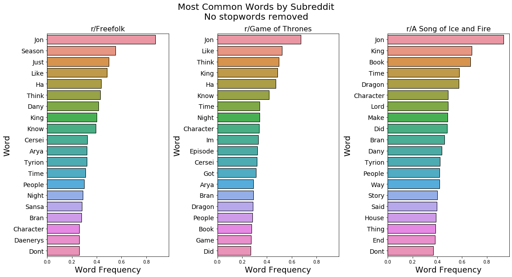

#  Project 3: Web APIs & NLP

## Problem Statement

As part of a policy shift from Reddit.com, we have been instructed to make the site more user-friendly by forcing the merger of redundant subreddits. It is our task to identify which subreddits fail to sufficiently differentiate themselves from competing subreddits on similar topics, and go about merging them.

Upon hearing of this policy shift, many subreddit moderators were incensed. In particular, the moderators of r/freefolk, r/gameofthrones, and r/asoiaf, three subreddits which all host discussion of the Song of Ice and Fire novel series and Game of Thrones television show, have come together in a rare moment of unity to express their insistence that they are very substantially different communities worth preserving in their current states.

We have decided to evaluate this claim objectively by testing whether or not the best machine learning classifier we can produce is able to tell posts from each of the three subreddits apart from each other. If we cannot generate accurate predictions of which subreddit a text post originates from with no other inputs besides the text of the posts themselves, we will be forced to combine the subreddits.

## Executive Summary

We have selected raw accuracy as our model evaluation metric; we simply wish to know if there are meaningful distinctions in the subreddits' contents, such that we can identify posts' origins better than simply guessing blindly.

We have elected to use a variety of classification models of increasing complexity to tackle this challenge. We will use generic and regularized logistic regressions, a Naive Bayes classifier, several different tree-based classifiers ranging in complexity from a single decision tree to random forests and boosted trees, and finally a support vector machine. After constructing each of these models, we will then create an ensemble vote model which averages all of our models' predictions, reaching for the highest possible accuracy by letting systematic issues in any of our individual models balance each other out.

To obtain the data, we will query the PushShift API, pulling three years worth of posts from each subreddit. We will then conduct certain cleaning and preprocessing steps, including dropping non-text posts from our set and removing URLs and Reddit markdown artifacts. We will then lemmatize all words in the dataset to standardize it.

After evaluating whether we have managed to beat a baseline accuracy rating determined by a dummy model which predicts the most frequent class, we will evaluate whether or not r/freefolk, r/gameofthrones, and r/asoiaf are, in fact, distinguishable.

## Project Workflow

### Data Sourcing and Cleaning

[get_data.py](./code/get_data.py)  

[clean_raw_data.py](./code/clean_raw_data.py)  

[preprocessing.py](./code/preprocessing.py)  

Our three data preparation scripts can be found in the project_3/code/ directory.

Our `get_data script` has a preset list of our three subreddits of interest ('asoiaf','freefolk', and 'gameofthrones'), and accepts a number of days to search posts across (starting from 1 day ago and going back). After sourcing and structuring the data into a dataframe, it saves it as a .csv in the project_3/data directory.

For our purposes, we gathered three years (1095 days) worth of data, which took about 1.5 hours with a 1.5 second delay between requests.

Our `clean_raw_data` script reads in the .csv outputted by get_data, drops unnecessary columns, and then removes all posts which are missing our model input columns ('title' and 'selftext). 

It then scrubs URLs, Reddit markdown artifacts, and punctuation from text columns. Finally, it drops any more rows which became empty due to cleaning or whose only text is '\[removed]' or '\[deleted]'. It then writes the remaining data to a new .csv.

Lastly, our `preprocessing` script reads the output file of our `clean_raw_data` script and tokenizes, lemmatizes, and rejoins our text columns, outputting our final .csv for analysis.

### Custom Stop Words

[additional_stopwords_identification.ipynb](./code/additional_stopwords_identification.ipynb)  

In this notebook, we explore the frequency of words in the dataset after excluding Scikit-Learn's built-in english-language stopwords.

  

Building an additional set of custom stopwords is important for this project in particular because of the massive topical overlap of our text sources. As you can see above, the three subreddits would be almost indistinguishable if you simply presented the most common words in each, even after removing generic english-language stopwords.

Our methodology involved finding the 100 most common words in the entire data set, and removing any which were not in the top 100 most common words in all three subreddits individually.

We then manually added several terms used for mandatory post title spoiler tags in r/asoiaf, which would have made the r/asoiaf posts trivially easy to recognize for our models, as we are including the titles in the full analysis text.

This notebook outputs a final .JSON of stopwords for us to append to Scikit-Learn's built-in stopwords.

### Data Exploration and Visualizations

[EDA And Visualizations.ipynb](./code/EDA And Visualizations.ipynb)  

In this notebook, we explore our text data in a bag-of-words state. We investigate the most common words per subreddit, and words which are distinctive to each subreddit.

### Modeling and Analysis

[Modeling and Analysis.ipynb](./code/Modeling and Analysis.ipynb)  

In this notebook, we build our models, tracking their accuracy, and make overall evaluations of model performance.

## Conclusions and Recommendations

Our models successfully beat the baseline of ~44% accuracy with our best model achieving a 60% accuracy on test data, demonstrating that there are substantive differences between r/freefolk, r/gameofthrones, and r/asoiaf. We thus recommend that all three subreddits be allowed to continue in their current forms.

If we wish to improve our classification models in the future, we would recomnmend devoting additional compute time to fine-combed hyperparameter searching over a wider space, using our full source data.

## Sources
- [Data Sourced from the PushShift API](https://github.com/pushshift/api)
- [Efficacy of Random Hyperparameter Search](https://towardsdatascience.com/random-search-vs-grid-search-for-hyperparameter-optimization-345e1422899d)
- [r/freefolk](https://www.reddit.com/r/freefolk)
- [r/gameofthrones](https://www.reddit.com/r/gameofthrones)
- [r/asoiaf](https://www.reddit.com/r/asoiaf)